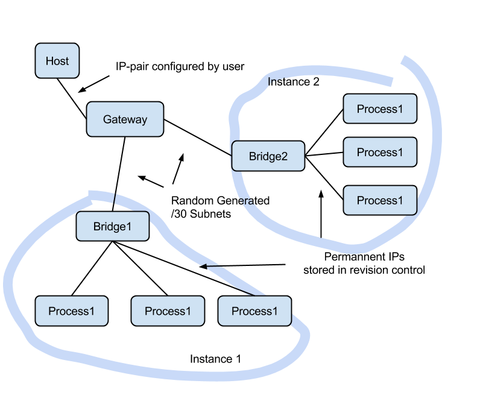

.. _network_testing:

===============
Network Testing
===============

Usually vagga runs processes in host network namespace. But there is a mode
for network testing.

.. warning:: This documentation is awfully incomplete. There is a good article_
   in the meantime. Except ``vagga_network`` command is replaced by
   ``vagga _network`` subcommand (note the space after ``vagga``)

Overview
========

For testing complex networks we leverage ``!Supervise`` type of commands to
run multiple nodes. But we also need a way to setup network. What we need in
particular:

1. The IPs should be hard-coded (i.e. checked in into version control)
2. Multiple different projects running simultaneously (and multiple instances
   of same project as a special case of it)
3. Containers should be able to access internet if needed

So we use "double-bridging" to get this working, as illustrated below:

The :ref:`network_setup` section describes how to setup a gateway in
the host system, and :ref:`container_setup` section describes how
to configure containers in ``vagga.yaml``. And
:ref:`network_partitioning` section describes how to implement tests
which break network and create network partitions of various kinds.

.. _network_setup:

Setup
=====

Unfortunately we can't setup network in fully non-privileged way. So you need
to do some preliminary setup. To setup a bridge run::

    vagga _create_netns

Running this will show what commands are going to run::

    We will run network setup commands with sudo.
    You may need to enter your password.

    The following commands will be run:
        sudo 'ip' 'link' 'add' 'vagga_guest' 'type' 'veth' 'peer' 'name' 'vagga'
        sudo 'ip' 'link' 'set' 'vagga_guest' 'netns' '16508'
        sudo 'ip' 'addr' 'add' '172.23.255.1/30' 'dev' 'vagga'
        sudo 'sysctl' 'net.ipv4.conf.vagga.route_localnet=1'
        sudo 'mount' '--bind' '/proc/16508/ns/net' '/run/user/1000/vagga/netns'
        sudo 'mount' '--bind' '/proc/16508/ns/user' '/run/user/1000/vagga/userns'

    The following iptables rules will be established:
        ["-I", "INPUT", "-i", "vagga", "-d", "127.0.0.1", "-j", "ACCEPT"]
        ["-t", "nat", "-I", "PREROUTING", "-p", "tcp", "-i", "vagga", "-d", "172.23.255.1", "--dport", "53", "-j", "DNAT", "--to-destination", "127.0.0.1"]
        ["-t", "nat", "-I", "PREROUTING", "-p", "udp", "-i", "vagga", "-d", "172.23.255.1", "--dport", "53", "-j", "DNAT", "--to-destination", "127.0.0.1"]
        ["-t", "nat", "-A", "POSTROUTING", "-s", "172.23.255.0/30", "-j", "MASQUERADE"]

Then immediatelly the commands are run, this will probably request your
password by sudo command. The ``iptables`` commands may depend on DNS server
settings in your ``resolv.conf``.

.. note:: you can't just copy these commands and run (or push exact these
   commands to ``/etc/sudoers``), merely because the pid of the process in
   mount commands is different each time.

You may see the commands that will be run without running them with
``--dry-run`` option::

    vagga _create_netns --dry-run

To destroy the created network you can run::

    vagga _destroy_netns

This uses ``sudo`` too

.. warning:: if you have ``172.23.0.0/16`` network attached to your machine,
   the ``_create_netns`` and ``_destroy_netns`` may break that network. We will
   allow to customize the network in future versions of vagga.

.. _container_setup:

Containers
==========

Here is a quick example of how to run network tests: vagga.yaml_

The configuration runs flask_ application with nginx_ and periodically
stops network between processes. For example here is test for normal
connection::

    $ vagga run-normal &
    $ vagga wrk http://172.23.255.2:8000 --latency
    Running 10s test @ http://172.23.255.2:8000
      2 threads and 10 connections
      Thread Stats   Avg      Stdev     Max   +/- Stdev
        Latency     6.07ms    1.05ms  20.21ms   94.69%
        Req/Sec   827.65     78.83     0.92k    86.00%
      Latency Distribution
         50%    5.82ms
         75%    6.11ms
         90%    6.54ms
         99%   11.62ms
      16485 requests in 10.00s, 2.86MB read
    Requests/sec:   1647.73
    Transfer/sec:    292.78KB

Here is the same test with bad network connection::

    $ vagga run-flaky &
    $ vagga wrk http://172.23.255.2:8000 --latency
    Running 10s test @ http://172.23.255.2:8000
      2 threads and 10 connections
      Thread Stats   Avg      Stdev     Max   +/- Stdev
        Latency   241.69ms  407.98ms   1.41s    81.67%
        Req/Sec   631.83    299.12     1.14k    71.05%
      Latency Distribution
         50%    7.27ms
         75%  355.09ms
         90%  991.64ms
         99%    1.37s
      5032 requests in 10.01s, 0.87MB read
    Requests/sec:    502.64
    Transfer/sec:     89.32KB

The run-flaky works as follows:

* Stop networking packets going between nginx and flask
  (``iptables .. -j DROP``)
* Sleep for a second
* Restore network
* Sleep for a second
* Repeat

The respective part of the configuration looks like:

.. code-block:: yaml

   interrupt: !BridgeCommand
     container: test
     run: |
       set -x
       while true; do
         vagga _network isolate flask
         sleep 1
         vagga _network fullmesh
         sleep 1
       done

As you can see in the test there are interesting differences:

* average latency is 241ms vs 5ms
* median latency is about the same
* 99 percentile of latency is 1.37s vs 11.62ms (i.e. 100x bigger)
* request rate 502 vs 1647

The absolute scale doesn't matter. But intuitively we could think that if
network doesn't work 50% of the time it should be 3x slower. But it isn't.
Different metrics are influenced in very different way.

.. _vagga.yaml: https://github.com/tailhook/vagga/blob/master/examples/flaky_network/vagga.yaml
.. _flask: http://flask.pocoo.org
.. _nginx: http://nginx.org

.. _network_partitioning:

Partitioning
============

# TBD

----

There is an article_ on how the network interface was designed
and why.

.. _article: https://medium.com/@paulcolomiets/evaluating-mesos-4a08f85473fb
